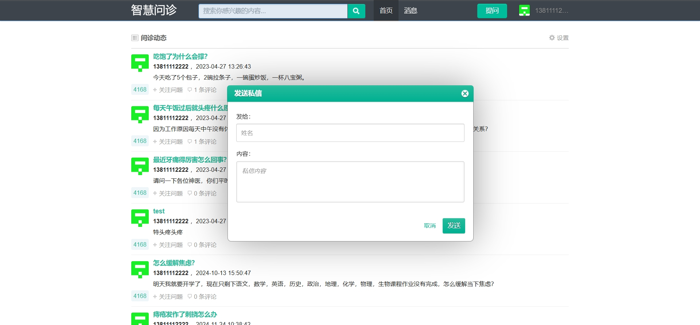

# 简易健康问答系统(文末获取方式☟)
> 
#### 介绍
简易健康问答系统
有BUG可留言加微

#### 软件架构
Java + SpringBoot + Mybatis + Mysql

#### 项目功能说明

> + 登录注册
> + 首页：问题标题、内容、发布时间、评论数量
> + 问题详情：评论、发布回答
> + 发送私信
> + 发布健康问题
> + 私信消息查看

### 部分功能演示

### 环境需求(可免费提供)
- idea/eclipse、jdk-1.8、maven-3.8.6、mysql、nodejs等

## 有项目修改、安装调试需求 请联系以下

## 获取资源扫☝☝☝
